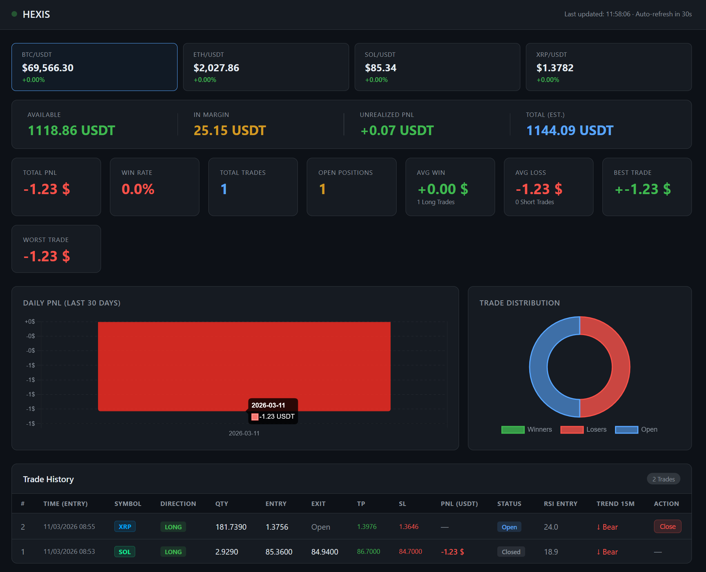

# HEXIS – Autonomous Crypto Trading Agent

An automated futures trading bot for the **Bitunix** exchange. Trades BTC, ETH, SOL and XRP using two strategies — trend-following and mean-reversion scalping — with a live web dashboard for monitoring and manual control.



---

## Features

- **Multi-symbol trading** — BTC, ETH, SOL, XRP running in parallel threads
- **Two strategies** configurable per symbol:
  - `trend` — RSI + EMA Crossover with 5m/15m multi-timeframe filter
  - `scalp` — Bollinger Bands + RSI(7) + Volume confirmation
- **Fixed fractional risk sizing** — position size based on % account risk / SL %
- **Learning phase** — margin capped at 25 USDT for the first 10 trades
- **Live web dashboard** — balance, open positions, PnL charts, trade history
- **Manual close buttons** — close any open position directly from the dashboard
- **Auto-sync** — detects TP/SL closures and updates the local database automatically

---

## Setup

### 1. Clone & install dependencies

```bash
git clone https://github.com/YOUR_USERNAME/hexis-trading-bot.git
cd hexis-trading-bot
pip install -r requirements.txt
```

### 2. Configure API keys

```bash
cp .env.example .env
```

Edit `.env` and add your Bitunix API credentials:

```
BITUNIX_API_KEY=your_api_key_here
BITUNIX_SECRET_KEY=your_secret_key_here
```

Get your API keys at [bitunix.com](https://www.bitunix.com) → Avatar → API Management.

### 3. Initialise the database

```bash
python init_db.py
```

### 4. Start the bot

```bash
python main.py
```

### 5. Open the dashboard (optional, separate terminal)

```bash
python web_dashboard.py
```

Then open [http://localhost:5000](http://localhost:5000) in your browser.

---

## Configuration

All settings are in `config.py`. Key parameters:

| Parameter | Default | Description |
|---|---|---|
| `SYMBOLS` | BTC, ETH, SOL, XRP | Symbols to trade |
| `STRATEGIES` | trend, trend, scalp, scalp | Strategy per symbol |
| `LEVERAGE` | 10x | Futures leverage (set on Bitunix) |
| `RISK_PER_TRADE` | 5% | Capital risk per trade |
| `STOP_LOSS_PCT` | 2.5% | Stop loss (trend) |
| `TAKE_PROFIT_PCT` | 5.0% | Take profit (trend, 2:1 R:R) |
| `SCALP_STOP_LOSS_PCT` | 0.8% | Stop loss (scalp) |
| `SCALP_TAKE_PROFIT_PCT` | 1.6% | Take profit (scalp, 2:1 R:R) |
| `MAX_MARGIN_TRADES` | 10 | Learning phase trade count |
| `MAX_MARGIN_USDT` | 25 USDT | Max margin during learning phase |
| `LOOP_INTERVAL_SECONDS` | 15 | Price check interval |

Parameters can also be set via environment variables in `.env`.

---

## Strategies

### Trend (RSI + EMA Crossover)

Uses a **15m trend filter** + **5m entry signal**:

- **Long**: 15m bullish (EMA9 > EMA21) + 5m EMA crossover up + RSI was oversold
- **Short**: 15m bearish (EMA9 < EMA21) + 5m EMA crossover down + RSI was overbought

### Scalp (Bollinger Bands + RSI + Volume)

Mean-reversion on the **5m chart**:

- **Long**: Price at lower BB + RSI(7) < 32 + RSI turning up + volume spike
- **Short**: Price at upper BB + RSI(7) > 68 + RSI turning down + volume spike

---

## Project Structure

```
hexis-trading-bot/
├── main.py              # Entry point, multi-symbol thread manager
├── config.py            # All configuration parameters
├── exchange.py          # Bitunix API connector (double SHA-256 auth)
├── strategy.py          # Trend strategy (RSI + EMA Crossover)
├── strategy_scalp.py    # Scalp strategy (Bollinger Bands)
├── indicators.py        # EMA, RSI, Bollinger Bands calculations
├── risk_manager.py      # Position sizing, TP/SL calculation
├── trader.py            # Order execution, position management
├── database.py          # SQLite trade history
├── web_dashboard.py     # Flask dashboard API
├── init_db.py           # Database initialisation script
├── templates/
│   └── dashboard.html   # Dashboard frontend
├── .env.example         # Environment variable template
└── requirements.txt     # Python dependencies
```

---

## Security

- API keys are stored **only** in `.env` (excluded from git via `.gitignore`)
- Never commit `.env` to version control
- The `.env.example` file contains only placeholders

---

## Disclaimer

This bot trades real money on live markets. Use at your own risk. Past performance does not guarantee future results. Always start with small position sizes and monitor the bot closely.
