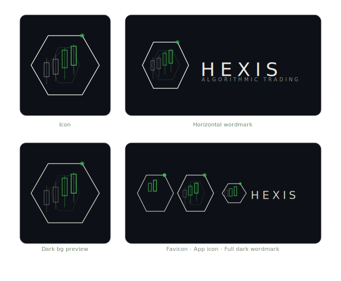
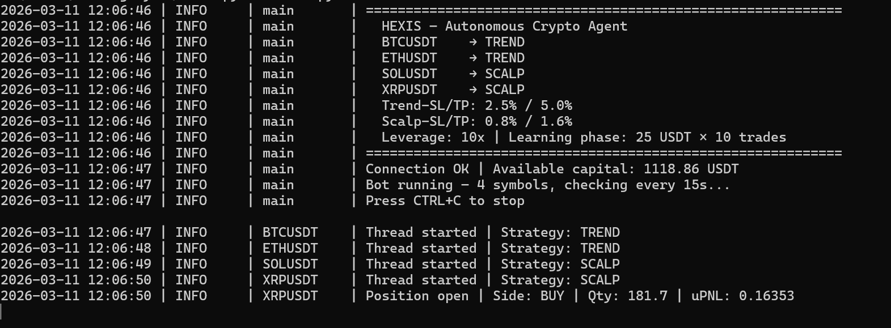

<p align="center">
  
</p>

# HEXIS – Autonomous Crypto Agent

An automated futures trading agent for the **Bitunix** exchange. Trades multiple symbols in parallel using four strategies — trend-following, scalping, Fibonacci sniper, and liquidity sweep orderblock — with a live web dashboard and an **AI Trade Analyst** that automatically tunes parameters based on performance.

> **Status: Active Test Phase** — The agent is currently running live with real capital in a controlled test environment. Position sizes are intentionally limited while strategies are being validated and refined.




---

## Features

- **Multi-symbol trading** — BTC, ETH, SOL, XRP, HYPE, ADA, BNB running in parallel
- **Four strategies** configurable per symbol (hot-swappable without restart):
  - `trend` — RSI + EMA Crossover with 5m/15m multi-timeframe filter
  - `scalp` — Bollinger Bands + RSI(7) + Volume confirmation
  - `sniper` — Fibonacci retracement entries (Fib 0.882) with partial TP cascade and Break Even stop
  - `lsob` — Liquidity Sweep + Orderblock re-entry
- **Agent Mode** — global scanner evaluates all 7 symbols × 4 strategies (28 combos) per tick and only opens the single best-scoring setup above a configurable threshold
- **AI Trade Analyst** — Claude (claude-opus-4-6) analyzes trade history every 4 hours and auto-adjusts the score threshold and per-symbol strategies based on actual performance
- **Fixed fractional risk sizing** — position size based on % account risk / SL distance
- **Learning phase** — margin capped at 25 USDT for the first 10 trades
- **Live web dashboard** — balance, unrealized PnL, open positions, PnL charts, trade history
- **Active Trades panel** — dedicated live view with real-time uPnL, partial profits taken, and manual close button
- **Trade History with pagination** — closed trades with 10 per page, Prev/Next navigation
- **Strategy badges** — colored TREND / SCALP / SNIPER / LSOB labels per trade
- **Live position sync** — qty and unrealized PnL synced from the exchange every 10 seconds
- **Manual close buttons** — close any open position directly from the dashboard
- **Auto-sync** — detects TP/SL closures and updates the local database automatically
- **Strategy hot-swap** — change strategy per symbol from the dashboard without restarting the agent

---

## Requirements

| Requirement | Details |
|---|---|
| Python | 3.10+ |
| Bitunix account | Futures trading enabled, API key with Read + Trade permissions |
| Anthropic API key | Required for AI Trade Analyst — [console.anthropic.com](https://console.anthropic.com) |

### Estimated running costs

| Service | Cost |
|---|---|
| Bitunix trading fees | ~0.02% per trade (maker/taker) |
| Anthropic API (AI Analyst) | ~$3/month at default 4h interval with claude-opus-4-6 |
| Server / VPS | Optional — can run locally; a small VPS (~$5/month) ensures 24/7 uptime |

> The $5 Anthropic free credit covers roughly 2 weeks at the default interval. After that, top up at [console.anthropic.com](https://console.anthropic.com/settings/billing). To reduce costs further, increase `ANALYSIS_INTERVAL_MINUTES` in `trade_analyst.py` or switch to `claude-haiku-4-5` (~$0.20/month).

---

## Setup

### 1. Clone & install dependencies

```bash
git clone https://github.com/hennioso/HEXIS.git
cd HEXIS
pip install -r requirements.txt
```

### 2. Configure API keys

```bash
cp .env.example .env
```

Edit `.env` and fill in your credentials:

```env
BITUNIX_API_KEY=your_bitunix_api_key_here
BITUNIX_SECRET_KEY=your_bitunix_secret_key_here
ANTHROPIC_API_KEY=your_anthropic_api_key_here
```

#### How to get your Bitunix API Key

1. Create an account at [bitunix.com](https://www.bitunix.com/register?inviteCode=vefzzy) *(referral link — appreciated but not required)*
2. Top-right corner → **Avatar → API Management**
3. Click **Create API Key**
4. Set a label (e.g. `HEXIS`), enable **Read** and **Trade** permissions
5. Copy **API Key** and **Secret Key** into `.env`
6. **Never share your Secret Key** — it is shown only once

#### How to get your Anthropic API Key

1. Sign up at [console.anthropic.com](https://console.anthropic.com)
2. Go to **API Keys → Create Key**
3. Copy the key into `.env` as `ANTHROPIC_API_KEY`
4. New accounts receive $5 free credit (~2 weeks at default settings)

> The AI Analyst is optional. If `ANTHROPIC_API_KEY` is missing or invalid, the bot starts normally and logs a warning — all trading functions work without it.

### 3. Initialise the database

```bash
python init_db.py
```

### 4. Start the agent

```bash
python main.py
```

### 5. Open the dashboard (optional, separate terminal)

```bash
python web_dashboard.py
```

Then open [http://localhost:5000](http://localhost:5000) in your browser.

---

## Configuration

All settings are in `config.py`. Key parameters:

| Parameter | Default | Description |
|---|---|---|
| `SYMBOLS` | 7 symbols | BTC, ETH, SOL, XRP, BNB, HYPE, ADA |
| `STRATEGIES` | all `auto` | Agent Mode by default (AI picks best strategy per tick) |
| `LEVERAGE` | 10x | Futures leverage (must be set on Bitunix for each symbol) |
| `RISK_PER_TRADE` | 5% | Capital risk per trade |
| `STOP_LOSS_PCT` | 2.5% | Stop loss (trend strategy) |
| `TAKE_PROFIT_PCT` | 5.0% | Take profit (trend strategy, 2:1 R:R) |
| `SCALP_STOP_LOSS_PCT` | 0.8% | Stop loss (scalp strategy) |
| `SCALP_TAKE_PROFIT_PCT` | 1.6% | Take profit (scalp strategy, 2:1 R:R) |
| `MAX_MARGIN_TRADES` | 10 | Learning phase trade count |
| `MAX_MARGIN_USDT` | 25 USDT | Max margin per trade during learning phase |
| `LOOP_INTERVAL_SECONDS` | 15 | Price check interval |

Parameters can also be overridden via environment variables in `.env`.

### Agent Mode scoring thresholds

The Agent Scanner scores all (symbol × strategy) combinations and only opens a trade when the best score exceeds `MIN_OPEN_SCORE` (default: 7). Maximum possible scores:

| Strategy | Max score |
|---|---|
| SNIPER (Fibonacci 0.882) | 10 |
| LSOB (Liquidity Sweep OB) | 9 |
| SCALP (BB + RSI + Volume) | 9 |
| TREND (EMA 9/21/50) | 7 |

> Note: raising the threshold to 8+ effectively excludes TREND entries (max 7).

The AI Analyst automatically adjusts this threshold based on win rate and trade quality.

---

## Strategies

### Trend (RSI + EMA Crossover)

Uses a **15m trend filter** + **5m entry signal**:

- **Long**: 15m bullish (EMA9 > EMA21) + 5m EMA crossover up + RSI was oversold
- **Short**: 15m bearish (EMA9 < EMA21) + 5m EMA crossover down + RSI was overbought

### Scalp (Bollinger Bands + RSI + Volume)

Mean-reversion on the **5m chart**:

- **Long**: Price at lower BB + RSI(7) < 32 + RSI turning up + volume spike
- **Short**: Price at upper BB + RSI(7) > 68 + RSI turning down + volume spike

### Sniper (Fibonacci Retracement)

Precision entries at key Fibonacci levels with a partial TP cascade:

- **Entry**: Price at Fib 0.882 (deep retracement into prior swing)
- **Structural SL**: Below swing low (long) / above swing high (short)
- **TP1** (Fib 0.820) → close 30% of position
- **TP2** (Fib 0.650) → close 50% of position
- **TP3** (Fib 0.500) → close 25% of position
- **Break Even stop**: After TP1, SL is automatically moved to entry price — remaining 5% runs protected

### LSOB (Liquidity Sweep Orderblock)

Smart money entry logic:

- **Sweep**: Price wicks past a prior swing high/low (liquidity grab), then closes back inside
- **Orderblock**: The last opposing candle before the sweep impulse
- **Entry**: Price re-enters the OB zone after the sweep
- **SL**: Structurally placed beyond the sweep wick
- **TP**: Prior liquidity / swing level on the opposite side

---

## AI Trade Analyst

HEXIS includes an AI-powered analyst that automatically evaluates performance and adjusts bot parameters.

**What it does:**
- Runs every **4 hours** (first run 30 minutes after startup)
- Reads the last 100 closed trades from the database
- Calls Claude (claude-opus-4-6 with adaptive thinking) to analyze win rates, PnL per strategy/symbol, and entry quality
- Receives structured recommendations and applies them automatically

**What it can adjust:**
- `MIN_OPEN_SCORE` — the Agent Scanner threshold (bounded to 5–9)
- Per-symbol strategy — pin a symbol to a specific strategy or revert to `auto`

**Safety:**
- Never adjusts while any position is open
- Requires at least 5 closed trades before first analysis
- All decisions are logged to `analyst.log` with full reasoning
- Adjustments are conservative — "no change" is always a valid recommendation

**Logs** (`analyst.log`):
```
============================================================
  ANALYSIS  2026-03-14 16:00 UTC
============================================================
Summary: Win rate 61% across 23 trades. SNIPER performing well (+$48 avg).
         TREND entries marginal (2W/5L). Score threshold appropriate.

Adjustments applied: True
Score: 7 → 7 (no change — current threshold filtering well)
  BTCUSDT: auto → sniper | SNIPER has 5 wins, 1 loss on BTC. Pin to capture more setups.
```

---

## Project Structure

```
HEXIS/
├── main.py              # Entry point — launches all threads
├── config.py            # All configuration parameters
├── exchange.py          # Bitunix API connector (double SHA-256 auth)
├── strategy.py          # Trend strategy (RSI + EMA Crossover)
├── strategy_scalp.py    # Scalp strategy (Bollinger Bands + Volume)
├── strategy_sniper.py   # Sniper strategy (Fibonacci retracement)
├── strategy_lsob.py     # LSOB strategy (Liquidity Sweep Orderblock)
├── strategy_scanner.py  # Global opportunity scanner (Agent Mode)
├── strategy_selector.py # Per-strategy scoring functions
├── strategy_state.py    # Per-symbol strategy state (hot-swap support)
├── trade_analyst.py     # AI Trade Analyst (Claude API integration)
├── indicators.py        # EMA, RSI, Bollinger Bands calculations
├── risk_manager.py      # Position sizing, TP/SL calculation
├── trader.py            # Order execution, position management, SNIPER TP monitor
├── database.py          # SQLite trade history with live PnL tracking
├── web_dashboard.py     # Flask dashboard API + exchange sync
├── init_db.py           # Database initialisation script
├── templates/
│   └── dashboard.html   # Dashboard frontend (vanilla JS + CSS)
├── .env.example         # Environment variable template
└── requirements.txt     # Python dependencies
```

---

## Security

- API keys are stored **only** in `.env` (excluded from git via `.gitignore`)
- Never commit `.env` to version control
- The `.env.example` file contains only placeholders — safe to commit
- The Anthropic API key only has access to the Messages API — no write access to your exchange

---

## Disclaimer

This agent trades real money on live markets. Use at your own risk. Past performance does not guarantee future results. Always start with small position sizes and monitor the agent closely. The AI Trade Analyst makes automated parameter changes — review `analyst.log` regularly to understand what it is adjusting and why.
